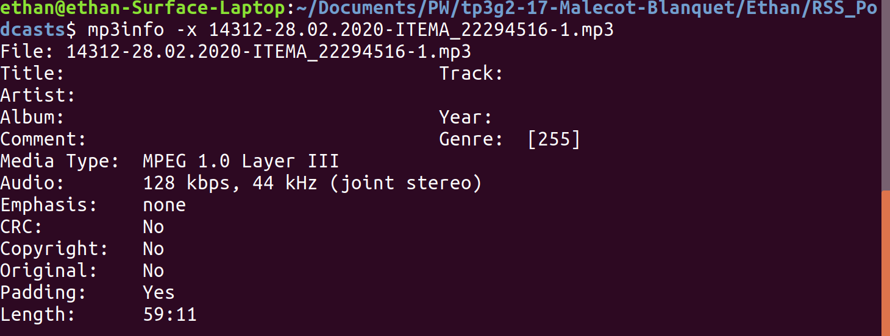
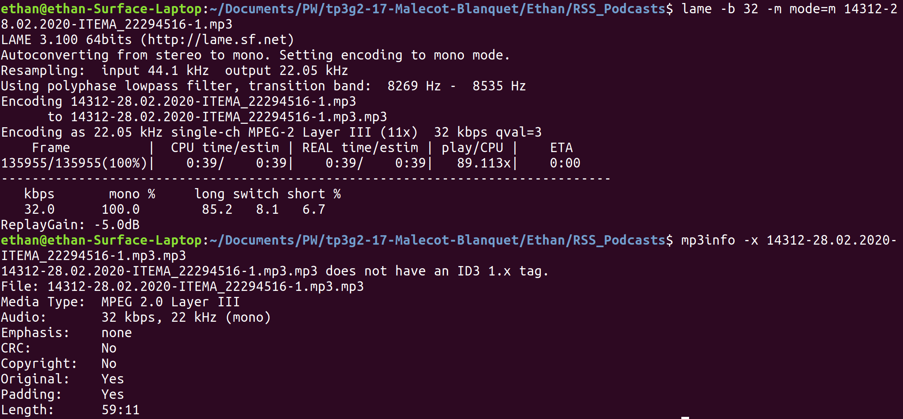

# tp3g2-17-Malecot-Blanquet

Malecot Ethan - Blanquet Antoine

# TP3 - TMDB & Podcasts

Quick Start
===

**Q:** Comment tester notre projet ?

**A:** Clonez-le et executez les fichiers php suivants :

  + TMDB : `/TMDB/film.php`
  + RSS_Podcasts: `/RSS_Podcasts/Vue/vueDashboard.php`
    * Tableaux des Podcasts : Vue Classique
    * Tableaux des Podcasts : Vue Classique - MultiPodcasts
    * Tableaux des Podcasts : Vue Classique - Liens Twitter
    * Tableaux des Podcasts : Vue Hebdomaire

:warning: Le répértoire `/old_versions` contient nos versions de dev du TP. Afin de progresser en PHP, nous avons décider de réaliser la majeur partie des questions de notre coté pour ensuite sélectionner les implémentations les plus cohérente dans les répertoires `/TMDB` et `/RSS_Podcasts`

---

## Partie 1 - Utilisation de The Movie Database
### 1. Mise en jambes

###### Q1 - Exploration. Quel est le format de réponse ? De quel film s’agit-il ? Essayez avec le paramètre supplémentaire language=fr

On obtient une réponse au format **JSON** : un format que l'on peut utiliser pour sérialiser des **données structurées** (tableaux, objets..). C'est cohérent ici car on souhaite structurer ici les données de nombreux films.

Le champ **"original_title"** nous donne le titre du film : "Fight Club".

Le paramètre **language=fr** nous permet d'obtenir le JSON du film avec les informations en français. Il doit exister différents fichiers avec la même structure JSON pour chacune des langues proposer par le site.

###### Q2 - Exploration CLI. Testez également le service avec curl en ligne de commande, puis avec un programme php minimal utilisant tp3-helper.php.

>Dans le fichier `utils.php`

On récupère le  fichier JSON d'un film et on le décode.

>function **getFilm**($id,$lang);

###### Q3 - Page de détail (web). Pour un film fourni par son identifiant (un entier), vous afficherez une page web donnant les éléments suivants : son titre, son titre original, sa tagline (si elle existe), sa description, et un lien vers la page publique TMDB.

>Dans le fichier `film.php` (Vue)

Affiche le contenu à l'utilisateur (film) et transmet les commandes de l'utilisateur au **Controleur** (id).

>Dans le fichier `utils.php` (Controleur)

Gestion de la logique du code : c'est ici qu'on créer la data pour la **Vue**.

>function **getFilm**($id,$lang) -> récupère un film en fonction de l'id fourni.

>function **afficherFilm**($film) -> affiche les informations du Film sur la page web (*film.php*).

>function **afficherData**($data,$label) -> affiche une donnée en particulier dans une div


### 2. Les choses sérieuses

Non implémenté : Choix du sujet d'approfondissement sur les **RSS_Podcasts**.

---

## Partie 2 - Analyse d'un flux RSS de podcast
### 1. Mise en jambes

:round_pushpin: Le code ici est implémenté sour le format MVC (Modèle Vue Controleur). Cependant, vu que nous ne gérons pas de base de données, la partie *Modèle* est absente

>Dans le fichier `Controleur/dashboard.php` (Controleur)

Gestion de la logique du code : c'est ici qu'on créer la data pour la **Vue**.

>Dans le fichier `Vue/vueDashboard.php` (Vue)

Affiche le contenu à l'utilisateur (podcasts) et transmet les commandes de l'utilisateur au **Controleur** (choix de l'affichage).

###### Q1. Tableau des podcasts

Affichage des émissions d'un ou plusieurs podcasts avec la fonction `displayPodcasts()` disponible dans `dashboard.php`

1.Récupération de données à partir du fichier au format RSS.
```
$date = date('j.n.Y H:i', (int) $item->timestamp);
$title = htmlspecialchars($item->title);
$enclosure = $item->enclosure->attributes();
$mp3 = $enclosure['url']; //récupération de l'attribut "url"
$namespacces = $item->getNamespaces(true);
$itunes = $item[0]->children($namespacces["itunes"]);
$duration = $itunes->duration;
```
2.Affichage des données dans un tableau html
```
printf("<tr>");
printf("<td>".$date."</td>");
printf("<td>".$title."</td>");
printf("<td><audio controls preload='none' src=".$mp3."></audio></td>");
printf("<td>".$duration."</td>");
printf("<td><a href=\"$mp3\" download=\"Koala\">Download</a></td>");
printf("</tr>");
```

:information_source: On ajoute également `echo "\n\t";` à chaque fin de ligne pour éviter d'avoir un code source html "illisible" **sur une seul ligne**. On indente celui-ci par nous même. Pour mieux comprendre, regardez le code source de la page généré.

### 2.  Les choses sérieuses

###### Q2. Intercalaire hebdomadaire. Le podcast MethSci est quotidien, avec une structure hebdomadaire, du lundi au vendredi. Le but ici est simplement d’ajouter au tableau de la question précédente des lignes intercalaires pour séparer la semaine. Chaque ligne ne contiendra qu’une seule cellule, indiquant le numéro de la semaine dans l’année.

Pour cette question, nous avons récupéré dans une variable le numéro de la semaine grace à fonction "date" de PHP qui avec l'argument 'W' rend le numéro de semaine. Puis nous avons ajouté une condition pour afficher sur une ligne la case de numéro de semaine seulement lorsque l'on change de semaine par rapport au dernier enregistrement audio traité (la commande colspan nous a permis de faire une seule case sur toute la ligne).

###### Q3. Tableau hebdomadaire. On demande cette fois un format compact hebdomadaire, chaque ligne représentant une semaine, les cinq épisodes représentés en ligne. Chaque colonne représentera un jour de la semaine (de lundi à vendredi), chaque cellule donnera la date, le titre (lien) et un lecteur mp3 de format compact (sans contrôle).

Afin d'obtenir un affichage Hebdomadaire nous avons commencé par inverser l'ordre d'arriver des élémentsdu flux rss, qui arrivait du plus récent au plus ancient, afin d'avoir la enregistrement audio dans l'ordre des jours de la semaine et non dans l'ordre inverse. Ensuite nous avons aussi ajouté une initialisation dans la boucle foreach pour placer correctement le premier enregistrement au jour correspondant et ainsi que tous les enregistrement après celui-ci soient directement bien placé sans avoir besoin de faire de calculs. Enfin, nous avons une condition sur la jour et une condition sur la semaine qui définissent si l'on passe à la case suivante et si l'on passe à la ligne suivante respectivement.

###### Q4. Plusieurs podcasts (difficile). Avec le tableau de la question 2, configurez deux ou trois podcasts différents et adaptez l’affichage pour mixer les sources dans le même tableau, en respectant (si possible) l’ordre chronologique. Même question avec le “tableau hebdomadaire” de la quesion 3. Quelles sont les difficultés rencontrées ? Devez-vous faire des compromis ou imposer des contraintes pour les contourner ?

Afin d'uniformiser le code, nous voulions afficher un ou plusieurs podcasts en utilisant la même fonction `displayPodcasts`
C'est pourquoi tous les podcasts RSS sont contenus dans une array (**$RSS_list**).
De plus, nous avons re-penser notre code pour fusionner chacun des affichages sur la même page web `vueDashboard.php` avec un choix d'affichage dans une liste déroulante.

Pour la question 4, nous avons procéder en 3 étapes d'implémentations :
1. Insérer **tous** les items de chacuns des podcasts dans une même array.
2. Trier cette liste en fonction de la date de publication du podcast
3. Afficher les podcasts, un par un avec l'item courant. (le podcast courant)

Pour l'étape 2 qui est la plus compliqué, nous avons utilisé la fonction `usort` de PHP, celle ci permet d'utiliser sa propre méthode de comparaison. En l'occurrence la comparaison d'une date par rapport à l'autre.
```
usort($item_list, "date_sort_modif");
```
```php
//Fonction de comparaison pour des dates
function date_sort_modif($d1, $d2) {
	$date1 = date('j.n.Y H:i', (int) $d1->timestamp); //On récupère la date de publication de l'item
	$date2 = date('j.n.Y H:i', (int) $d2->timestamp);
  return strtotime($date2) - strtotime($date1);
}
```

###### Q5. Attribut du MP3

Le bitrate standart du podcast est 128 kbps et il est en stéreo (une impression d'écran correspondant aux commandes effectuée dans la console est jointe ci dessous). Ces informations sont données en utilisant mp3info avec -x.


###### Q6. Réencodage

En utilisant `lame` les deux argument pour faire le réencodage demandé sont :

-> `-b` 32 pour obtenir les 32 kbps demandés

-> `-m` mode=m pour obtenir le mode mono au lieu de stereo

Une impression d'ecran est jointe ainsi que les fichiers mp3 avant et après réencodage (`RSS_Podcasts/14312-28.02.2020-ITEMA_22294516-1.mp3` (avant) et `RSS_Podcasts/14312-28.02.2020-ITEMA_22294516-1.mp3.mp3` (après)).



###### Q7. Liens twitter L’équipe de l’émission La Méthode Scientifique utilise Twitter en direct pour ajouter des informations, graphiques, liens, etc. Le fil twitter créé chaque jour est rappelé sur la page de description de l’émission, avec cette information : Retrouvez aussi les sources de cette émission sur le fil Twitter de La Méthode scientifique Peut-on récupérer automatiquement ce lien en analysant la page ? Il reste alors à modifier le tableau hebdomadaire pour y intégrer le lien.

Partie DOM : getTwitterLink :  *Rédaction en cours*

Affichage des ressources twitter avec la fonction `getTwitterLink()` disponible dans `dashboard.php`

1. Récupération du DOM du site web
> Pour rechercher le lien twitter sur la page de des podcasts, nous avons récupérant son DOM en PHP.
 >`$html = new simple_html_dom();
$html->load_file($url);`

2. Interprétation du DOM pour récupérer le lien Twitter
> Parcours sur chacuns des paragraphes existants
> Si celui contient la mention de '[Thread]', on récupère alors son lien.

###### Q8. Liens twitter dans le mp3 Peut-on directement intégrer le lien vers le fil twitter dans le fichier mp3 considéré ? Quelles conventions et quelles limitations cela impose ?

Implémentation non réussi : tests réalisés dans `Vue/testMP3.php` ..

Utilisation de la bibliothèque ***getID3***

###### Q9. Pour aller plus loin : API Twitter Twitter fournit une API web qui permet de récupérer et chercher des tweets de façon très puissante. Cependant une clé développeur et un mécanisme d’authentification forte rendent l’API Twitter trop complexe pour le cadre de ce TP. Mais vous pouvez vous y intéresser à titre personnel.

Non implémenté.
